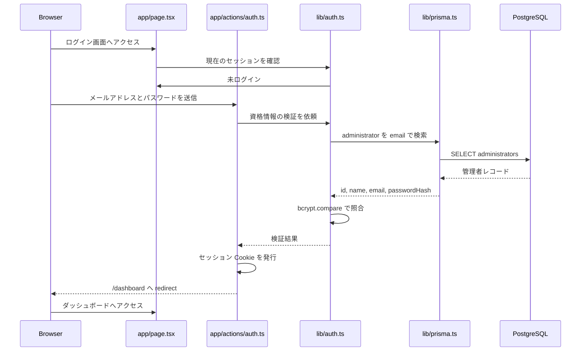

# Polish-DWR

業務日報を登録、検索、集計、PDF出力できる管理者向けウェブアプリの要件定義、設計、および実装状況を整理したドキュメントです。

## 0. 現在の実装状況

2026年3月24日時点で、以下の機能が実装済みです。

### 0.1 実装済み

- 管理者ログイン、ログアウト、Cookie セッション認証
- 初期管理者 seed 投入
- Prisma 7 + PostgreSQL 接続基盤
- 日報の新規登録、一覧表示、条件検索、更新、削除
- 日報一覧の集計サマリー表示
- 日報一覧の検索条件 URL クエリ同期
- 条件付き CSV 出力
- 選択日報ベースの伝票 PDF 出力
- 管理者追加、編集、有効/無効切替
- ダッシュボードでの実データサマリー表示

### 0.2 部分実装

- PDF 帳票
	- 実装済み: 日報一覧で選択したデータを対象に、作業伝票、納品書、請求書を個別または一括で PDF ダウンロード
	- 生成方式: React PDF によるサーバー側生成

### 0.3 未実装

- 管理者の削除
- 日報詳細専用画面
- 監査ログ
- テストコード
- 本番用の権限細分化

### 0.4 実装済み画面

- ログイン画面: [app/page.tsx](app/page.tsx)
- ダッシュボード: [app/dashboard/page.tsx](app/dashboard/page.tsx)
- 日報一覧: [app/reports/page.tsx](app/reports/page.tsx)
- 伝票ページ: [app/invoices/page.tsx](app/invoices/page.tsx)
- 日報登録: [app/reports/new/page.tsx](app/reports/new/page.tsx)
- 日報編集: [app/reports/[id]/edit/page.tsx](app/reports/[id]/edit/page.tsx)
- 管理者追加・編集・有効/無効: [app/administrators/page.tsx](app/administrators/page.tsx)

### 0.5 実装済み API

- 認証 API
	- [app/api/auth/login/route.ts](app/api/auth/login/route.ts)
	- [app/api/auth/logout/route.ts](app/api/auth/logout/route.ts)
	- [app/api/auth/session/route.ts](app/api/auth/session/route.ts)
- 日報 API
	- [app/api/reports/route.ts](app/api/reports/route.ts)
	- [app/api/reports/[id]/route.ts](app/api/reports/[id]/route.ts)
	- [app/api/reports/summary/route.ts](app/api/reports/summary/route.ts)
	- [app/api/reports/export.csv/route.ts](app/api/reports/export.csv/route.ts)
	- [app/api/invoices/pdf/route.ts](app/api/invoices/pdf/route.ts)
- 管理者 API
	- [app/api/administrators/route.ts](app/api/administrators/route.ts)
	- [app/api/administrators/[id]/route.ts](app/api/administrators/[id]/route.ts)

## 1. プロジェクト概要

- プロジェクト名: Polish-DWR
- 目的: 日々の業務実績を入力・蓄積し、条件検索、集計、帳票出力を可能にする
- 利用者: ログイン済みの管理者のみ
- 提供形態: Next.js ベースのウェブアプリケーション

## 2. 要件定義

### 2.1 業務要件

- 管理者が日報データを日次または任意の日付で登録できること
- 登録済みの日報データを一覧表示できること
- 一覧から期間や各入力項目で検索、絞り込みできること
- 一覧画面で集計結果を確認できること
- 選択した日報データを伝票 PDF としてダウンロードできること
- 管理者のみがアプリを利用できること
- 初期管理者を環境設定で投入できること
- ログイン済み管理者が別の管理者を追加、編集、無効化できること

### 2.2 機能要件

#### 認証機能

- メールアドレスとパスワードでログインできること
- 管理者アカウントはメールアドレス、名前、パスワードを保持すること
- 未認証ユーザーは管理画面へアクセスできないこと
- ログアウトできること

#### 日報登録機能

- 日報を新規登録できること
- 既存日報を編集できること
- 不要な日報を削除できること
- 登録時に必須項目と型の妥当性を検証すること

#### 日報一覧・検索機能

- 登録済み日報を一覧表示できること
- 日付範囲で絞り込みできること
- 各項目で部分一致または完全一致検索ができること
- 検索結果に対する件数や集計値を表示できること

#### 集計・帳票機能

- 売上金額、作業分、工数分、移動分、台数、基準分、ポイントなどを集計できること
- 集計結果を画面表示できること
- 選択した日報データから作業伝票、納品書、請求書を PDF 出力できること

#### 管理者管理機能

- ログイン済み管理者が新規管理者を作成できること
- 管理者一覧を参照できること
- ログイン済み管理者が管理者情報を編集できること
- ログイン済み管理者が管理者アカウントを無効化できること

### 2.3 非機能要件

- フレームワーク: Next.js
- フロントエンド: React
- 言語: TypeScript
- データベース: PostgreSQL
- 本番 DB: Neon を想定
- ローカル開発 DB: Docker 上の PostgreSQL を想定
- デプロイ先: Vercel
- CI/CD: GitHub を利用
- セキュリティ: 認証必須、パスワードはハッシュ化して保存すること
- 可用性: 一般的な業務利用を想定し、検索と一覧表示が実用的な速度で動作すること
- 保守性: 入力、認証、集計、出力の責務を分離した構成にすること

## 3. 入力項目定義

日報 1 件あたりの入力項目は以下とする。

| 項目名 | 型 | 必須 | 説明 |
| --- | --- | --- | --- |
| 日付 | date | 必須 | 業務実施日 |
| 得意先コード | string | 必須 | 得意先識別コード |
| 得意先 | string | 必須 | 得意先名 |
| 作業分 | number | 必須 | 作業時間分 |
| 工数分 | number | 必須 | 工数時間分 |
| 移動分 | number | 必須 | 移動時間分 |
| 車種 | string | 任意 | 対象車種 |
| 作業コード | string | 必須 | 作業分類コード |
| 新規/既存 | enum | 必須 | 新規 または 既存 |
| 台数 | number | 必須 | 対象台数 |
| 売上金額 | number | 必須 | 売上額 |
| 基準分 | number | 任意 | 基準時間分 |
| ポイント | number | 任意 | 評価用ポイント |
| 備考 | string | 任意 | 補足事項 |

## 4. 基本設計

### 4.1 システム構成

- クライアント: ブラウザ
- アプリケーション: Next.js アプリケーション
- 認証: 管理者ログイン機能
- データベース: PostgreSQL
- 帳票出力: サーバー側または API 経由で PDF 生成

想定構成:

1. 管理者がブラウザからログインする
2. Next.js が認証状態を確認する
3. 認証済みユーザーのみ日報 CRUD、検索、集計機能を利用する
4. データは PostgreSQL に保存する
5. 集計結果は画面表示および PDF 出力する

### 4.2 画面設計

#### ログイン画面

- 入力項目: メールアドレス、パスワード
- 処理: 認証、エラーメッセージ表示、ログイン後ホームへ遷移

#### ダッシュボード画面

- 主要導線: 日報登録、日報一覧、集計結果、管理者追加
- 補助情報: 期間別件数、売上合計、ポイント合計などのサマリー表示

#### 日報登録・編集画面

- 入力フォームを 1 件分表示
- 登録、更新、削除操作を提供
- 入力エラーを項目単位で表示

#### 日報一覧画面

- 日報一覧をテーブル形式で表示
- 日付範囲、得意先コード、得意先、車種、作業コード、新規/既存などで絞り込み
- 対象件数と集計結果を一覧上部または下部に表示

#### PDF 出力画面または出力操作

- 現在の検索条件を引き継いで PDF を出力
- 出力対象期間や集計項目を明示

#### 管理者追加画面

- 入力項目: 名前、メールアドレス、パスワード
- 登録済みメールアドレスの重複を防止

### 4.3 データ設計

#### 管理者テーブル

| カラム名 | 型 | 説明 |
| --- | --- | --- |
| id | uuid または serial | 主キー |
| name | varchar | 管理者名 |
| email | varchar | ログイン用メールアドレス、ユニーク |
| password_hash | varchar | ハッシュ化済みパスワード |
| created_at | timestamp | 作成日時 |
| updated_at | timestamp | 更新日時 |

#### 日報テーブル

| カラム名 | 型 | 説明 |
| --- | --- | --- |
| id | uuid または serial | 主キー |
| work_date | date | 日報日付 |
| client_code | varchar | 得意先コード |
| client_name | varchar | 得意先 |
| work_minutes | integer | 作業分 |
| labor_minutes | integer | 工数分 |
| travel_minutes | integer | 移動分 |
| car_type | varchar | 車種 |
| work_code | varchar | 作業コード |
| customer_status | varchar | 新規/既存 |
| unit_count | integer | 台数 |
| sales_amount | integer or numeric | 売上金額 |
| standard_minutes | integer | 基準分 |
| points | integer or numeric | ポイント |
| remarks | text | 備考 |
| created_by | foreign key | 登録管理者 |
| created_at | timestamp | 作成日時 |
| updated_at | timestamp | 更新日時 |

### 4.4 業務ルール

- 日報は認証済み管理者のみ登録、編集、削除できる
- 初期管理者は環境変数またはセットアップ処理で作成する
- メールアドレスは管理者間で一意とする
- 数値項目は負数を許可しない前提で設計する
- PDF は検索結果または指定期間に基づく集計結果を出力対象とする

### 4.5 API 設計方針

- 認証 API: ログイン、ログアウト、セッション確認
- 日報 API: 一覧取得、詳細取得、作成、更新、削除
- 集計 API: 条件付き集計取得
- 帳票 API: PDF 出力
- 管理者 API: 管理者追加

API は認証前提とし、未認証アクセスには 401 を返す。

### 4.6 バリデーション方針

- 必須項目未入力を防止する
- 数値項目は数値変換と範囲チェックを行う
- 日付は不正形式を拒否する
- 新規/既存は定義済み値のみ許可する
- メールアドレスは形式チェックを行う
- パスワードは最低文字数などのルールを別途定義する

### 4.7 権限制御

- 未ログイン状態ではアプリ主要機能へアクセス不可
- ログイン済み管理者のみ日報操作と集計閲覧が可能
- ログイン済み管理者のみ管理者追加が可能

## 5. 開発方針

### 5.1 想定技術スタック

- Next.js 16
- React 19
- TypeScript 5
- ESLint 9
- Tailwind CSS 4

### 5.2 開発環境

- アプリ起動: `npm run dev`
- 本番ビルド: `npm run build`
- Lint: `npm run lint`
- 初期管理者 seed 実行: `npm run prisma:seed`
- 日報ダミーデータ seed 実行: `npm run prisma:seed:reports`
- ローカル DB 起動: `docker compose up -d`
- ローカル DB 停止: `docker compose down`

### 5.3 ローカル PostgreSQL 起動設定

- Docker Compose 設定ファイル: [docker-compose.yml](docker-compose.yml)
- 接続設定の雛形: [.env.example](.env.example)
- ローカル用環境変数: [.env](.env)

起動手順:

1. [.env](.env) の接続情報を必要に応じて調整する
2. `docker compose up -d` を実行する
3. PostgreSQL が起動したら `DATABASE_URL` を使って Prisma から接続する

ローカル DB のデフォルト設定:

- DB 名: `polish_dwr`
- ユーザー: `postgres`
- パスワード: `postgres`
- ポート: `5433`
- 認証用シークレット: `AUTH_SECRET`
- PDF フォントパス: `PDF_FONT_PATH` を指定すると PDF 出力時の埋め込みフォントを上書き可能

### 5.4 インフラ方針

- ソースコード管理: GitHub
- CI/CD: GitHub Actions を想定
- 本番デプロイ: Vercel
- 本番データベース: Neon PostgreSQL
- ローカル DB: Docker 上の PostgreSQL

### 5.5 Prisma スキーマ詳細設計

Prisma は 7 系を採用し、スキーマ定義と CLI 設定を分離する。

- Prisma schema: [prisma/schema.prisma](prisma/schema.prisma)
- Prisma 設定: [prisma.config.ts](prisma.config.ts)
- 接続ユーティリティ: [lib/prisma.ts](lib/prisma.ts)
- 初回マイグレーション: [prisma/migrations/20260324044422_init/migration.sql](prisma/migrations/20260324044422_init/migration.sql)

設計方針:

- DB の論理設計は [DB_DESIGN.md](DB_DESIGN.md) を正とし、Prisma schema はその実装表現として管理する
- テーブル名とカラム名は PostgreSQL 側で snake_case を採用し、アプリ側は Prisma のモデル名・フィールド名で camelCase を利用する
- UUID を主キーとし、作成日時と更新日時は全主要テーブルに持たせる
- Prisma Client の runtime 接続は PostgreSQL adapter を必須とする

#### 管理者モデル詳細

Administrator モデルは管理者認証と将来の管理者追加機能の基礎となる。

主要フィールド:

- id: UUID 主キー
- name: 管理者表示名
- email: ログイン ID。ユニーク制約を付与
- passwordHash: bcrypt でハッシュ化したパスワード
- createdAt: 作成日時
- updatedAt: 更新日時

制約・インデックス:

- email に一意制約を設定し、同一メールアドレスでの重複作成を防止する
- passwordHash は平文を保持しない

#### 日報モデル詳細

DailyWorkReport モデルは日報入力、一覧、検索、集計の中心テーブルとする。

主要フィールド:

- workDate: 日報日付
- clientCode: 得意先コード
- clientName: 得意先名
- workMinutes: 作業分
- laborMinutes: 工数分
- travelMinutes: 移動分
- carType: 車種
- workCode: 作業コード
- customerStatus: 新規または既存
- unitCount: 台数
- salesAmount: 売上金額
- standardMinutes: 基準分
- points: ポイント
- remarks: 備考
- createdById: 登録した管理者の外部キー

制約・インデックス:

- createdById は administrators.id を参照する外部キーとする
- 一覧・検索性能を考慮し、workDate、clientCode、clientName、workCode、customerStatus に索引を付与する
- customerStatus は enum として管理し、アプリ側の不正値投入を防止する

#### Prisma runtime 接続詳細

Prisma 7 系では schema 側ではなく [prisma.config.ts](prisma.config.ts) で接続 URL を指定する。

- DATABASE_URL は [.env](.env) または本番環境変数から読み込む
- アプリ本体では [lib/prisma.ts](lib/prisma.ts) が PrismaPg adapter 付き PrismaClient を singleton で生成する
- 開発時のホットリロードによる PrismaClient の多重生成を避けるため global キャッシュを利用する

#### マイグレーション運用方針

- スキーマ変更時は Prisma Migrate を使って migration を生成する
- 初回 migration で administrators と daily_work_reports、および関連 enum と index を作成済み
- 開発 DB のスキーマを基準にしつつ、README、DB 設計書、Prisma schema の三者整合を保つ

#### seed 設計

- seed スクリプトは [prisma/seed.mjs](prisma/seed.mjs) で管理する
- 日報ダミーデータ投入スクリプトは [prisma/seed-reports.mjs](prisma/seed-reports.mjs) で管理する
- INITIAL_ADMIN_NAME、INITIAL_ADMIN_EMAIL、INITIAL_ADMIN_PASSWORD を用いて初期管理者を投入する
- 同一メールアドレスの管理者が存在する場合は再作成しない冪等実行とする
- 初期パスワードは bcrypt でハッシュ化して保存する
- 日報ダミーデータは過去約 3 ヶ月分を生成し、再実行時は同スクリプトで投入したダミーデータのみ入れ直す

### 5.6 ログイン認証詳細設計

管理者認証は Next.js App Router と Server Action を前提に、Cookie ベースのセッション管理で実装する。

関連ファイル:

- 認証ヘルパー: [lib/auth.ts](lib/auth.ts)
- ログイン・ログアウト Action: [app/actions/auth.ts](app/actions/auth.ts)
- ログイン画面: [app/page.tsx](app/page.tsx)
- ログインフォーム: [app/login-form.tsx](app/login-form.tsx)
- 認証後画面: [app/dashboard/page.tsx](app/dashboard/page.tsx)

#### 認証方式

- 認証対象は administrators テーブルに登録された管理者のみとする
- ログイン時はメールアドレスで管理者を検索し、passwordHash と入力パスワードを bcrypt.compare で照合する
- 認証成功時は管理者 ID と有効期限を含むセッション payload を生成する
- payload は HMAC-SHA256 で署名し、改ざん検知可能な Cookie として保存する

#### セッション設計

- Cookie 名: polish_dwr_session
- 保持内容: administratorId、expiresAt、署名
- 署名鍵: AUTH_SECRET
- 有効期間: 7 日
- Cookie 属性: httpOnly、sameSite=lax、path=/、production 時は secure=true

セッションの流れ:

1. ログインフォームからメールアドレスとパスワードを送信する
2. Server Action が [lib/auth.ts](lib/auth.ts) を通じて資格情報を検証する
3. 検証成功時に署名付き Cookie を発行する
4. 以降の Server Component は Cookie を読み取り、現在の管理者を特定する
5. ログアウト時は Server Action が Cookie を削除する

#### Next.js 16 における実装制約への対応

- cookies() は非同期 API として扱う
- Cookie の読み取りは Server Component または server-only のヘルパーで行う
- Cookie の set と delete は Server Action でのみ実施する
- 認証後リダイレクトは Server Action 側で redirect を使用する

#### 画面遷移設計

- 未ログインでトップページへアクセスした場合: ログイン画面を表示
- ログイン済みでトップページへアクセスした場合: ダッシュボードへ redirect
- 未ログインでダッシュボードへアクセスした場合: トップページへ redirect
- ログアウト後: トップページへ redirect

#### エラーハンドリング方針

- 入力不足や不正な formData はログイン失敗として扱い、汎用エラーメッセージを返す
- メールアドレス不一致またはパスワード不一致時は、アカウントの存在有無を秘匿した同一メッセージを返す
- 不正なセッション Cookie や期限切れセッションは未ログインとして扱う
- 本番環境で AUTH_SECRET 未設定の場合は起動時または認証処理時にエラーとする

#### セキュリティ設計

- パスワードの平文保存は禁止し、DB には password_hash のみ保持する
- セッション Cookie は httpOnly にしてクライアント JavaScript から参照不可とする
- Cookie 値は署名で保護し、改ざんされた場合は無効化する
- 認証済み判定は Cookie の存在のみではなく署名検証と DB 上の管理者存在確認まで行う
- 開発環境では AUTH_SECRET に暫定値を許容するが、本番では必須にする

#### 今後の拡張方針

- 管理者追加機能では passwordHash 生成ロジックを [lib/auth.ts](lib/auth.ts) 周辺へ共通化する余地がある
- より強いセキュリティが必要になった場合は DB セッション方式または認証ライブラリ導入を検討する
- 監査ログが必要になった場合はログイン成功・失敗・ログアウトを記録する

### 5.7 認証フロー詳細設計

認証フローはログイン画面、Server Action、認証ヘルパー、Prisma、PostgreSQL の責務分離で構成する。

#### ログイン処理シーケンス



#### セッション確認シーケンス

1. Server Component が Cookie を取得する
2. [lib/auth.ts](lib/auth.ts) が署名検証と有効期限検証を行う
3. administratorId を使って DB 上の管理者存在確認を行う
4. 有効な場合のみ現在の管理者情報を返す
5. 無効な場合は null を返し、呼び出し元でログイン画面へ遷移させる

#### ログアウト処理シーケンス

1. ダッシュボード上のログアウト操作を送信する
2. Server Action が Cookie を delete する
3. トップページへ redirect する
4. 次回アクセス時は未認証として扱う

#### 認証責務の分離

- app/page.tsx: ログイン画面の表示とログイン済み判定による redirect
- app/login-form.tsx: フォーム入力と Action 実行
- app/actions/auth.ts: Cookie 更新を伴うログイン・ログアウト処理
- lib/auth.ts: 資格情報照合、セッション生成、セッション検証
- lib/prisma.ts: Prisma Client の生成と再利用

### 5.8 日報 CRUD 詳細設計

日報 CRUD は認証済み管理者のみ利用できる前提で、登録、更新、削除のすべてに対して入力検証と操作者情報の一貫性を担保する。

#### 登録機能

目的:

- 管理者が日次の業務実績を 1 件ずつ登録できるようにする

入力項目:

- 日付
- 得意先コード
- 得意先名
- 作業分
- 工数分
- 移動分
- 車種
- 作業コード
- 新規/既存
- 台数
- 売上金額
- 基準分
- ポイント
- 備考

登録時の処理:

1. 認証済み管理者を取得する
2. 入力値を server side で型変換する
3. 必須項目、数値範囲、enum 値、日付形式を検証する
4. createdById に現在の管理者 ID を設定する
5. daily_work_reports へ INSERT する
6. 登録成功後は一覧または詳細画面へ遷移する

登録時の検証ルール:

- workDate は有効な日付であること
- clientCode、clientName、workCode は空文字不可
- workMinutes、laborMinutes、travelMinutes、unitCount、salesAmount は 0 以上
- standardMinutes、points は未入力を許可するが、入力時は 0 以上
- customerStatus は NEW または EXISTING のみ許可する

#### 更新機能

目的:

- 登録済み日報の誤入力や内容変更に対応する

更新時の処理:

1. 対象 ID の日報存在確認を行う
2. 認証済み管理者であることを確認する
3. 更新対象フィールドを再度検証する
4. daily_work_reports を UPDATE する
5. updatedAt を自動更新する

更新方針:

- 業務上の編集権限制約が追加されるまでは、ログイン済み管理者全員に更新を許可する
- 将来的に登録者本人のみ編集可能とする場合に備え、createdById を保持する

#### 削除機能

目的:

- 重複登録や誤登録データを除去する

削除時の処理:

1. 対象 ID の存在確認を行う
2. 認証済み管理者であることを確認する
3. 論理削除要件がない現時点では物理削除とする
4. 削除後は一覧画面へ戻し、再検索結果を再表示する

削除方針:

- 現時点では監査ログ未実装のため、削除操作の履歴は保持しない
- 将来的に誤削除復旧が必要になった場合は deletedAt を追加して論理削除へ切り替える

#### 一覧・詳細取得機能

一覧取得では日報テーブルを検索条件付きで参照し、詳細取得では単一レコードを返す。

一覧検索条件:

- 日付開始
- 日付終了
- 得意先コード
- 得意先名
- 車種
- 作業コード
- 新規/既存

一覧取得時の仕様:

- 指定条件がない場合は新しい日付順で一覧表示する
- 条件指定時は where 句を動的に構築する
- 件数とあわせて売上金額、作業分、工数分、移動分、台数、基準分、ポイントの合計を返せる構造にする
- 将来的なページング追加を見越して limit と offset を扱える設計にする

#### データ整合性方針

- 作成者を daily_work_reports.created_by に必ず記録する
- 更新操作では認証情報と更新対象の整合性を確認する
- 集計は検索条件と同一条件で実行し、一覧件数と集計結果が一致するようにする

#### 画面遷移詳細設計

日報機能はログイン後のダッシュボードを起点として、一覧、登録、編集、削除確認の各画面を遷移させる。

主要画面:

- ダッシュボード画面
- 日報一覧画面
- 日報登録画面
- 日報編集画面
- 日報削除確認導線
- 管理者追加画面

画面遷移フロー:

1. ログイン成功後にダッシュボード画面へ遷移する
2. ダッシュボードから日報一覧画面へ遷移する
3. 日報一覧画面から日報登録画面へ遷移する
4. 日報一覧画面から対象行の編集操作で日報編集画面へ遷移する
5. 日報一覧画面から対象行の削除操作で削除確認を表示し、確定後に一覧へ戻す
6. ダッシュボードから管理者追加画面へ遷移する

#### ダッシュボード画面詳細

目的:

- 認証後の起点画面として、日報管理機能と管理者機能への導線を提供する

表示要素:

- ログイン中の管理者名とメールアドレス
- 日報一覧への導線
- 日報登録への導線
- 集計結果確認への導線
- 管理者追加への導線
- ログアウト操作

想定遷移:

- 日報一覧ボタン押下で日報一覧画面へ
- 新規登録ボタン押下で日報登録画面へ
- 管理者追加ボタン押下で管理者追加画面へ

#### 日報一覧画面詳細

目的:

- 登録済み日報の検索、閲覧、編集、削除、集計確認をまとめて行う

表示要素:

- 検索フォーム
- 一覧テーブル
- 件数表示
- 集計サマリー
- 新規登録ボタン
- 行単位の編集ボタン
- 行単位の削除ボタン
- PDF 出力ボタン

検索フォーム項目:

- 日付開始
- 日付終了
- 得意先コード
- 得意先名
- 車種
- 作業コード
- 新規/既存

一覧画面での遷移:

- 新規登録ボタンで日報登録画面へ
- 編集ボタンで対象日報の編集画面へ
- 削除ボタンで削除確認ダイアログを表示し、確定後に一覧を再読込する
- PDF 出力ボタンで同一検索条件の帳票出力 API を呼び出す

#### 日報登録画面詳細

目的:

- 新規日報を正しい形式で登録する

表示要素:

- 日報入力フォーム
- 登録ボタン
- キャンセルボタン
- 項目単位のエラーメッセージ

遷移と振る舞い:

- 登録成功時は日報一覧画面へ戻し、成功メッセージを表示する
- キャンセル時は日報一覧画面へ戻る
- バリデーション失敗時は同画面に留まり、入力内容とエラーを表示する

#### 日報編集画面詳細

目的:

- 既存日報を修正する

表示要素:

- 既存値を初期表示した日報入力フォーム
- 更新ボタン
- キャンセルボタン
- 項目単位のエラーメッセージ

遷移と振る舞い:

- 更新成功時は日報一覧画面へ戻し、更新完了を通知する
- キャンセル時は一覧画面へ戻る
- 対象日報が存在しない場合は一覧画面へ戻し、未存在メッセージを表示する

#### 削除確認導線詳細

目的:

- 誤削除を防止する

表示要素:

- 対象日報の主要項目
- 削除確認メッセージ
- 削除確定ボタン
- キャンセルボタン

遷移と振る舞い:

- 削除確定時は API 実行後に一覧を再取得する
- キャンセル時は一覧表示を維持する

#### 管理者追加画面詳細

目的:

- ログイン済み管理者が新しい管理者を追加する

表示要素:

- 名前
- メールアドレス
- パスワード
- 登録ボタン
- キャンセルボタン
- バリデーションエラー表示

遷移と振る舞い:

- 登録成功時はダッシュボードまたは管理者一覧相当画面へ戻る
- 重複メールアドレス時は同画面に留まりエラー表示する
- キャンセル時はダッシュボードへ戻る

### 5.9 API 詳細設計

UI 主導のログイン・ログアウトは Server Action を利用するが、日報、集計、帳票、管理者機能は Route Handler 化しやすいよう HTTP API の形でも詳細設計を定義する。

#### 共通方針

- ベースパスは /api とする
- すべての API は管理者認証を前提とする
- 未認証時は 401 Unauthorized を返す
- バリデーションエラーは 400 Bad Request を返す
- 対象未存在は 404 Not Found を返す
- 予期しない障害は 500 Internal Server Error を返す

レスポンス共通形式:

```json
{
	"data": {},
	"error": null
}
```

エラー時の共通形式:

```json
{
	"data": null,
	"error": {
		"code": "VALIDATION_ERROR",
		"message": "入力内容を確認してください。"
	}
}
```

#### 認証 API

ログインは現実装では Server Action を利用するが、将来 API 化する場合の設計を以下とする。

| 機能 | Method | Path | 説明 |
| --- | --- | --- | --- |
| ログイン | POST | /api/auth/login | メールアドレスとパスワードでログイン |
| ログアウト | POST | /api/auth/logout | セッションを破棄 |
| セッション確認 | GET | /api/auth/session | 現在のログイン管理者を取得 |

POST /api/auth/login:

リクエスト例:

```json
{
	"email": "admin@example.com",
	"password": "change-me"
}
```

成功レスポンス例:

```json
{
	"data": {
		"administrator": {
			"id": "uuid",
			"name": "Administrator",
			"email": "admin@example.com"
		}
	},
	"error": null
}
```

#### 日報 API

| 機能 | Method | Path | 説明 |
| --- | --- | --- | --- |
| 日報一覧取得 | GET | /api/reports | 条件付き一覧と件数を取得 |
| 日報詳細取得 | GET | /api/reports/:id | 単一日報を取得 |
| 日報作成 | POST | /api/reports | 新規登録 |
| 日報更新 | PATCH | /api/reports/:id | 既存日報を更新 |
| 日報削除 | DELETE | /api/reports/:id | 既存日報を削除 |

GET /api/reports のクエリ例:

- startDate=2026-03-01
- endDate=2026-03-31
- clientCode=C001
- clientName=株式会社サンプル
- carType=普通車
- workCode=W001
- customerStatus=NEW
- page=1
- pageSize=50

GET /api/reports のレスポンス例:

```json
{
	"data": {
		"items": [
			{
				"id": "uuid",
				"workDate": "2026-03-24",
				"clientCode": "C001",
				"clientName": "株式会社サンプル",
				"workMinutes": 60,
				"laborMinutes": 45,
				"travelMinutes": 30,
				"carType": "普通車",
				"workCode": "W001",
				"customerStatus": "NEW",
				"unitCount": 1,
				"salesAmount": 12000,
				"standardMinutes": 50,
				"points": 3,
				"remarks": "初回訪問"
			}
		],
		"pagination": {
			"page": 1,
			"pageSize": 50,
			"total": 1
		}
	},
	"error": null
}
```

POST /api/reports のリクエスト例:

```json
{
	"workDate": "2026-03-24",
	"clientCode": "C001",
	"clientName": "株式会社サンプル",
	"workMinutes": 60,
	"laborMinutes": 45,
	"travelMinutes": 30,
	"carType": "普通車",
	"workCode": "W001",
	"customerStatus": "NEW",
	"unitCount": 1,
	"salesAmount": 12000,
	"standardMinutes": 50,
	"points": 3,
	"remarks": "初回訪問"
}
```

PATCH /api/reports/:id の方針:

- 部分更新を許可する
- 未指定フィールドは既存値を維持する
- 更新対象フィールドも作成時と同じ検証を通す

DELETE /api/reports/:id のレスポンス例:

```json
{
	"data": {
		"deleted": true
	},
	"error": null
}
```

#### 集計 API

| 機能 | Method | Path | 説明 |
| --- | --- | --- | --- |
| 条件付き集計取得 | GET | /api/reports/summary | 一覧条件に対応する集計結果を取得 |

GET /api/reports/summary のレスポンス例:

```json
{
	"data": {
		"count": 12,
		"salesAmountTotal": 240000,
		"workMinutesTotal": 720,
		"laborMinutesTotal": 600,
		"travelMinutesTotal": 180,
		"unitCountTotal": 15,
		"standardMinutesTotal": 640,
		"pointsTotal": 42
	},
	"error": null
}
```

#### PDF 出力 API

| 機能 | Method | Path | 説明 |
| --- | --- | --- | --- |
| PDF 出力 | GET | /api/reports/export.pdf | 検索条件に対応した帳票を PDF で返す |

仕様:

- クエリパラメータは /api/reports と同一形式を基本とする
- レスポンスは application/pdf とする
- 出力対象 0 件時の扱いは空帳票または 400 を実装時に選定する

#### 管理者 API

| 機能 | Method | Path | 説明 |
| --- | --- | --- | --- |
| 管理者追加 | POST | /api/administrators | 新規管理者を追加 |
| 管理者一覧 | GET | /api/administrators | 管理者一覧を取得 |
| 管理者更新 | PATCH | /api/administrators/:id | 名前、メールアドレス、パスワードを更新 |
| 管理者有効/無効 | PATCH | /api/administrators/:id | isActive を切り替えてログイン可否を制御 |

POST /api/administrators のリクエスト例:

```json
{
	"name": "Sub Admin",
	"email": "sub-admin@example.com",
	"password": "change-me-too"
}
```

バリデーション方針:

- email は形式チェックと重複チェックを行う
- password は最低文字数を設ける
- name は空文字不可とする
- 登録時に password を bcrypt でハッシュ化する
- 最後の有効管理者は無効化できない
- ログイン中の管理者自身は無効化できない

#### 実装優先順

1. ログイン・ログアウトの Server Action
2. 日報一覧取得 API
3. 日報作成 API
4. 日報更新 API
5. 日報削除 API
6. 集計 API
7. PDF 出力 API
8. CSV 出力 API
9. 管理者追加 API
10. 管理者更新・無効化 API

## 6. 今後の実装検討事項

- 管理者削除機能の要否
- 検索条件保存機能の要否
- PDF レイアウト詳細
- CSV 列構成や外部連携要件の追加要否
- 集計軸の追加要件
- 監査ログの要否

## 7. 初期実装優先度

1. 管理者認証
2. 日報 CRUD
3. 日報一覧と検索
4. 集計表示
5. PDF 出力
6. 管理者追加

## 8. 備考

本 README は [../プロジェクト概要.md](../%E3%83%97%E3%83%AD%E3%82%B8%E3%82%A7%E3%82%AF%E3%83%88%E6%A6%82%E8%A6%81.md) をもとに、実装着手前の要件定義と基本設計として整理したものです。詳細設計では認証方式、DB スキーマの制約、PDF 生成方式、検索 UI の具体仕様を確定します。

## 9. 関連設計書

- DB 設計書: [DB_DESIGN.md](DB_DESIGN.md)
